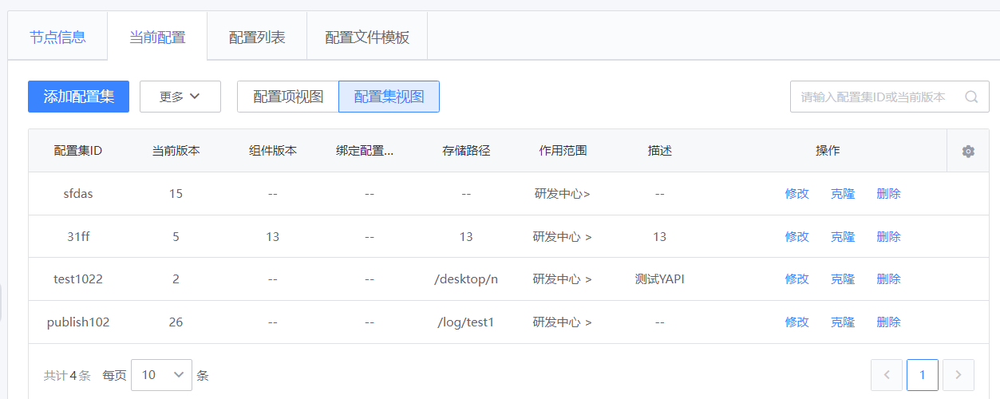
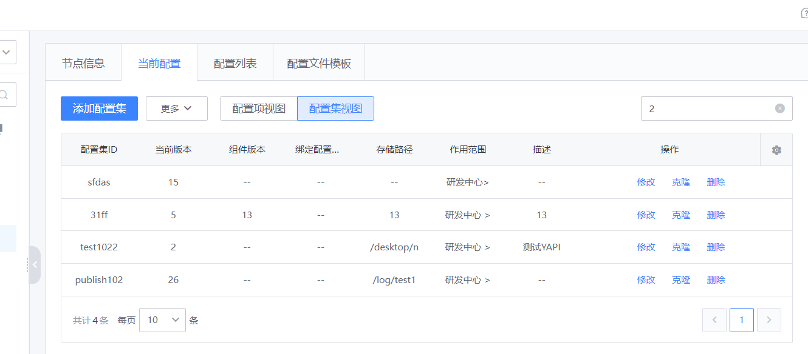

## 背景及需求

- 表：配置集、配置集版本、配置项
- 关系：一个配置集有多个版本，一个配置集版本有多个配置项



## 原始写法

### 原始代码

~~~python
query = ConfigSet.objects.filter(moduletoconfigset__module=module_id).order_by("-id")
if not User.objects.filter(bk_username=request.user.username, is_super=True).exists():
	query = query.filter(create_by=request.user.username)

# 标识符is_current_config，代表在当前配置上操作
if is_current_config:
	query = query.filter(configsetversion__state="has")

# 按搜索条件筛选
if content:
	query = query.filter(
		Q(data_id__contains=content) | Q(configsetversion__version__contains=content)
	).distinct()

paginator = Paginator(query, page_size)
count = paginator.count
res = paginator.get_page(page).object_list.values()
for i in res:
    if is_current_config:
        last_ver = ConfigSetVersion.objects.filter(config_set_id=i["id"], state="has").last()
    else:
        last_ver = ConfigSetVersion.objects.filter(config_set_id=i["id"]).last()
    i["now_version"] = last_ver.version
    i["scope"] = ",".join(
        [i.module_name for i in ModuleToConfigSet.objects.filter(config_set_id=i["id"])]
    )
~~~

### 查询得到的结果

当输入'2'查询的时候，查询的结果里面不符合需求：查询配置集ID或版本中包含'2'数据



### 生成的SQL

生成的SQL语句中，出现了同一张表关联了多次进行链表查询，以及where条件的判断，导致数据出错。

~~~sql
SELECT DISTINCT
	`cw_config_configset`.`id`,
	`cw_config_configset`.`create_by`,
	`cw_config_configset`.`create_time`,
	`cw_config_configset`.`update_time`,
	`cw_config_configset`.`update_by`,
	`cw_config_configset`.`data_id`,
	`cw_config_configset`.`storage_path`,
	`cw_config_configset`.`type`,
	`cw_config_configset`.`dis`,
	`cw_config_configset`.`dis_version` 
FROM
	`cw_config_configset`
	INNER JOIN `cw_config_moduletoconfigset` ON ( `cw_config_configset`.`id` = `cw_config_moduletoconfigset`.`config_set_id` )
	INNER JOIN `cw_config_configsetversion` ON ( `cw_config_configset`.`id` = `cw_config_configsetversion`.`config_set_id` )
	INNER JOIN `cw_config_configsetversion` T4 ON ( `cw_config_configset`.`id` = T4.`config_set_id` )
	INNER JOIN `cw_config_configsetversion` T5 ON ( `cw_config_configset`.`id` = T5.`config_set_id` )
	LEFT OUTER JOIN `cw_config_configsetversion` T6 ON ( `cw_config_configset`.`id` = T6.`config_set_id` )
	LEFT OUTER JOIN `cw_config_configsetversion` T7 ON ( `cw_config_configset`.`id` = T7.`config_set_id` )
	LEFT OUTER JOIN `cw_config_configsetversion` T8 ON ( `cw_config_configset`.`id` = T8.`config_set_id` )
	LEFT OUTER JOIN `cw_config_configsetversion` T9 ON ( `cw_config_configset`.`id` = T9.`config_set_id` ) 
WHERE
	(
		`cw_config_moduletoconfigset`.`module` = 117 
		AND `cw_config_configsetversion`.`state` = 'has' 
		AND T4.`version` LIKE BINARY '%2%' 
		AND T5.`version` LIKE BINARY '%2%' 
		AND ( `cw_config_configset`.`data_id` LIKE BINARY '%2%' OR T6.`version` LIKE BINARY '%2%' ) 
		AND ( `cw_config_configset`.`data_id` LIKE BINARY '%2%' OR T7.`version` LIKE BINARY '%2%' ) 
		AND ( `cw_config_configset`.`data_id` LIKE BINARY '%2%' OR T8.`version` LIKE BINARY '%2%' ) 
		AND ( `cw_config_configset`.`data_id` LIKE BINARY '%2%' OR T9.`version` LIKE BINARY '%2%' ) 
	) 
ORDER BY
	`cw_config_configset`.`id` DESC;
~~~

### SQL查询结果

```
+----+-----------+---------------------+---------------------+-----------+-------------+------------------+--------+----------+-------------+
| id | create_by | create_time         | update_time         | update_by | data_id     | storage_path     | type   | dis      | dis_version |
+----+-----------+---------------------+---------------------+-----------+-------------+------------------+--------+----------+-------------+
| 29 | product   | 2021-10-27 14:52:48 | 2021-11-10 10:03:16 | product   | sfdas       |                  | sfa    |          |             |
|  8 | product   | 2021-10-26 15:56:52 | 2021-10-27 14:25:12 | product   | 31ff        | 13               | 13     | 13       | 13          |
|  3 | product   | 2021-10-22 14:47:04 | NULL                | NULL      | test1022    | /desktop/newfile | 服务器 | 测试YAPI |             |
|  1 | product   | 2021-10-21 17:18:42 | 2021-10-28 20:51:19 | product   | publish1021 | /log/test1       | 服务器 |          |             |
+----+-----------+---------------------+---------------------+-----------+-------------+------------------+--------+----------+-------------+
4 rows in set (0.18 sec)
```

## 预期

### 预期结果SQL

根据需求，编写相应的SQL如下

```sql
SELECT
	`cw_config_configset`.`id`,
	`cw_config_configset`.`create_by`,
	`cw_config_configset`.`create_time`,
	`cw_config_configset`.`update_time`,
	`cw_config_configset`.`update_by`,
	`cw_config_configset`.`data_id`,
	`cw_config_configsetversion`.`version`,
	`cw_config_configset`.`storage_path`,
	`cw_config_configset`.`type`,
	`cw_config_configset`.`dis`,
	`cw_config_configset`.`dis_version` 
FROM
	`cw_config_configset`
	INNER JOIN `cw_config_configsetversion` ON ( `cw_config_configset`.`id` = `cw_config_configsetversion`.`config_set_id` )
	INNER JOIN `cw_config_moduletoconfigset` ON ( `cw_config_configset`.`id` = `cw_config_moduletoconfigset`.`config_set_id` ) 
WHERE
	`cw_config_configsetversion`.`state` = 'has' 
	AND ( `cw_config_configset`.`data_id` LIKE BINARY '%2%' OR `cw_config_configsetversion`.`version` LIKE BINARY '%2%' ) 
	AND `cw_config_moduletoconfigset`.`module` = 117 
ORDER BY
	`cw_config_configset`.`id` DESC;
```

### 预期结果

编写的SQL查询的数据和预期的结果一致。

```
+----+-----------+---------------------+---------------------+-----------+-------------+---------+------------------+--------+----------+-------------+
| id | create_by | create_time         | update_time         | update_by | data_id     | version | storage_path     | type   | dis      | dis_version |
+----+-----------+---------------------+---------------------+-----------+-------------+---------+------------------+--------+----------+-------------+
|  3 | product   | 2021-10-22 14:47:04 | NULL                | NULL      | test1022    | 2       | /desktop/newfile | 服务器 | 测试YAPI |             |
|  1 | product   | 2021-10-21 17:18:42 | 2021-10-28 20:51:19 | product   | publish1021 | 26      | /log/test1       | 服务器 |          |             |
+----+-----------+---------------------+---------------------+-----------+-------------+---------+------------------+--------+----------+-------------+
2 rows in set (0.11 sec)
```


## 第一次优化

从上面的Django代码出发，尝试减少Django中使用queryset.filter的次数，特别是其中出钱外键关联的情况，这种情况会导致代码中增加关联的表数量。

### Django代码

~~~python
query = ConfigSet.objects.all()
query_dict = {"moduletoconfigset__module": module_id}
if not User.objects.filter(bk_username=request.user.username, is_super=True).exists():
	query_dict['create_by'] = request.user.username
	
if is_current_config:
	query_dict['configsetversion__state'] = "has"
query = query.filter(**query_dict)

if content:
	query = query.filter(
		Q(data_id__contains=content) | Q(configsetversion__version__contains=content)
	).distinct()
query = query.order_by("-id")
~~~

### 生成的SQL

~~~sql
SELECT DISTINCT
	`cw_config_configset`.`id`,
	`cw_config_configset`.`create_by`,
	`cw_config_configset`.`create_time`,
	`cw_config_configset`.`update_time`,
	`cw_config_configset`.`update_by`,
	`cw_config_configset`.`data_id`,
	`cw_config_configset`.`storage_path`,
	`cw_config_configset`.`type`,
	`cw_config_configset`.`dis`,
	`cw_config_configset`.`dis_version` 
FROM
	`cw_config_configset`
	INNER JOIN `cw_config_configsetversion` ON ( `cw_config_configset`.`id` = `cw_config_configsetversion`.`config_set_id` )
	INNER JOIN `cw_config_moduletoconfigset` ON ( `cw_config_configset`.`id` = `cw_config_moduletoconfigset`.`config_set_id` )
	LEFT OUTER JOIN `cw_config_configsetversion` T4 ON ( `cw_config_configset`.`id` = T4.`config_set_id` ) 
WHERE
	(
		`cw_config_configsetversion`.`state` = 'has' 
		AND `cw_config_moduletoconfigset`.`module` = 117 
	AND ( `cw_config_configset`.`data_id` LIKE BINARY '%2%' OR T4.`version` LIKE BINARY '%2%' )) 
ORDER BY
	`cw_config_configset`.`id` DESC;
~~~

### SQL查询结果

生成的SQL中关联的表少了，然而数据还是错误的。

```
+----+-----------+---------------------+---------------------+-----------+-------------+------------------+--------+----------+-------------+
| id | create_by | create_time         | update_time         | update_by | data_id     | storage_path     | type   | dis      | dis_version |
+----+-----------+---------------------+---------------------+-----------+-------------+------------------+--------+----------+-------------+
| 29 | product   | 2021-10-27 14:52:48 | 2021-11-10 10:03:16 | product   | sfdas       |                  | sfa    |          |             |
|  8 | product   | 2021-10-26 15:56:52 | 2021-10-27 14:25:12 | product   | 31ff        | 13               | 13     | 13       | 13          |
|  3 | product   | 2021-10-22 14:47:04 | NULL                | NULL      | test1022    | /desktop/newfile | 服务器 | 测试YAPI |             |
|  1 | product   | 2021-10-21 17:18:42 | 2021-10-28 20:51:19 | product   | publish1021 | /log/test1       | 服务器 |          |             |
+----+-----------+---------------------+---------------------+-----------+-------------+------------------+--------+----------+-------------+
4 rows in set (0.09 sec)
```


## 最终优化

如何去优化？从语气的SQL以及第一次优化的情况来看，减少queryset.filter，但是最后使用Q的貌似无法只写将查询条件写到query_dict里面。

在SQL语句中，OR条件的查询可以修改为使用UNION以提高性能，这里也可以使用这种方式，将Q这种方式的或查询修改为使用UNION的方式来进行查询。

### Django代码

~~~python
query = ConfigSet.objects.all()
query_dict = {"moduletoconfigset__module": module_id}

if not User.objects.filter(bk_username=request.user.username, is_super=True).exists():
	query_dict["create_by"] = request.user.username
	
if is_current_config:
	query_dict["configsetversion__state"] = "has"
	
query_dict2 = {}
if content:
	query_dict2 = copy.deepcopy(query_dict)
	query_dict["data_id__contains"] = content
	query_dict2["configsetversion__version__contains"] = content
if not query_dict2:
	query = query.filter(**query_dict).order_by("-id").distinct()
else:
	query = query.filter(**query_dict).union(query.filter(**query_dict2)).order_by("-id").distinct()
~~~

### 生成的SQL

生成的SQL和预期的SQL不一致，但是与将预期SQL中的OR条件改用UNION的方式查询是一样的

~~~sql
( SELECT
	`cw_config_configset`.`id`,
	`cw_config_configset`.`create_by`,
	`cw_config_configset`.`create_time`,
	`cw_config_configset`.`update_time`,
	`cw_config_configset`.`update_by`,
	`cw_config_configset`.`data_id`,
	`cw_config_configset`.`storage_path`,
	`cw_config_configset`.`type`,
	`cw_config_configset`.`dis`,
	`cw_config_configset`.`dis_version` 
	FROM
		`cw_config_configset`
		INNER JOIN `cw_config_configsetversion` ON ( `cw_config_configset`.`id` = `cw_config_configsetversion`.`config_set_id` )
		INNER JOIN `cw_config_moduletoconfigset` ON ( `cw_config_configset`.`id` = `cw_config_moduletoconfigset`.`config_set_id` ) 
	WHERE
		( `cw_config_configsetversion`.`state` = 'has' AND `cw_config_configset`.`data_id` LIKE BINARY '%2%' AND `cw_config_moduletoconfigset`.`module` = 117 ) 
	ORDER BY
		`cw_config_configset`.`id` ASC 
	) UNION
	(
	SELECT
		`cw_config_configset`.`id`,
		`cw_config_configset`.`create_by`,
		`cw_config_configset`.`create_time`,
		`cw_config_configset`.`update_time`,
		`cw_config_configset`.`update_by`,
		`cw_config_configset`.`data_id`,
		`cw_config_configset`.`storage_path`,
		`cw_config_configset`.`type`,
		`cw_config_configset`.`dis`,
		`cw_config_configset`.`dis_version` 
	FROM
		`cw_config_configset`
		INNER JOIN `cw_config_configsetversion` ON ( `cw_config_configset`.`id` = `cw_config_configsetversion`.`config_set_id` )
		INNER JOIN `cw_config_moduletoconfigset` ON ( `cw_config_configset`.`id` = `cw_config_moduletoconfigset`.`config_set_id` ) 
	WHERE
		( `cw_config_configsetversion`.`state` = 'has' AND `cw_config_configsetversion`.`version` LIKE BINARY '%2%' AND `cw_config_moduletoconfigset`.`module` = 117 ) 
	ORDER BY
		`cw_config_configset`.`id` ASC 
	) 
ORDER BY
	( 1 ) DESC
~~~

### SQL查询结果

执行可以得到正确的结果

```
+----+-----------+---------------------+---------------------+-----------+-------------+------------------+--------+----------+-------------+
| id | create_by | create_time         | update_time         | update_by | data_id     | storage_path     | type   | dis      | dis_version |
+----+-----------+---------------------+---------------------+-----------+-------------+------------------+--------+----------+-------------+
|  3 | product   | 2021-10-22 14:47:04 | NULL                | NULL      | test1022    | /desktop/newfile | 服务器 | 测试YAPI |             |
|  1 | product   | 2021-10-21 17:18:42 | 2021-10-28 20:51:19 | product   | publish1021 | /log/test1       | 服务器 |          |             |
+----+-----------+---------------------+---------------------+-----------+-------------+------------------+--------+----------+-------------+
2 rows in set (0.11 sec)
```

### 最终结果


## 总结

在Django中使用ORM查询数据时，尽量将查询条件都组装成一个字典的形式去查询，而不是使用queryset.filter的方式。使用queryset.filter可能带来数据不正确的风险（三张及以上表的情况），当出现多表关联的时候性能相对于关联少量表的情况差。

上面问题的另一中解决方法就是直接使用ORM中的raw方法，直接去执行SQL语句，这样不仅能够得到正确的数据，而且性能还比使用ORM的性能好！

